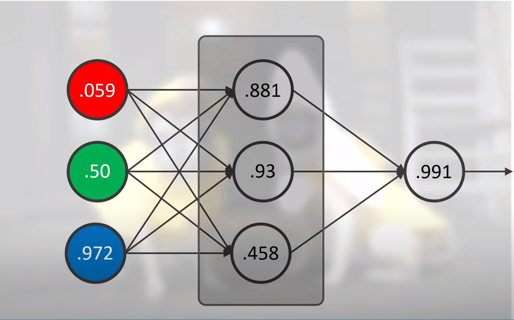

# Introducción a la Inteligencia Artificial
Una breve introducción a la inteligencia artificial utilizando dos bibliotecas de JavaScript: BrainJs y TensorFlowJs.

# Red neuronal con BrainJs
neural-network-brainjs contiene código HTML y JavaScript que utiliza la biblioteca Brain.js para entrenar una red neuronal y predecir el mejor color de texto para un color de fondo dado. La página web tiene un color de entrada que se actualiza en tiempo real y un div con el texto "Mi sitio web". El color de fondo del div cambia según la entrada del usuario y el color del texto se establece en función de la predicción de la red neuronal.
# Red neuronal con TensorFLowJs
neural-network-tensorflowjs  contiene el mismo HTML pero el código JavaScript utiliza la biblioteca tensorflow.js en su lugar.

# Cómo funciona
En el código JavaScript, se crea una instancia de red neuronal y se entrena con algunos ejemplos de color de fondo y texto. Cada ejemplo se proporciona como una entrada de tres valores (rojo, verde, azul) que representan el color de fondo y una salida de un valor que representa el mejor color de texto para ese fondo (1 para blanco, 0 para negro).

Luego, se define una función llamada "update", que se ejecuta cuando se cambia la entrada de color. Esta función actualiza el color de fondo del div y utiliza los valores de entrada para obtener una predicción del mejor color de texto de la red neuronal. El resultado se utiliza para establecer el color del texto en el div en blanco o negro. El código también utiliza la biblioteca jscolor para crear una entrada de color fácil de usar.

# Uso
Para utilizar este código, simplemente abra el archivo HTML en un navegador web. Verá una caja de entrada para seleccionar un color y un div con el texto "Mi sitio web". A medida que cambia la entrada de color, el color de fondo del div cambiará y el color del texto se actualizará en función de la predicción de la red neuronal.
